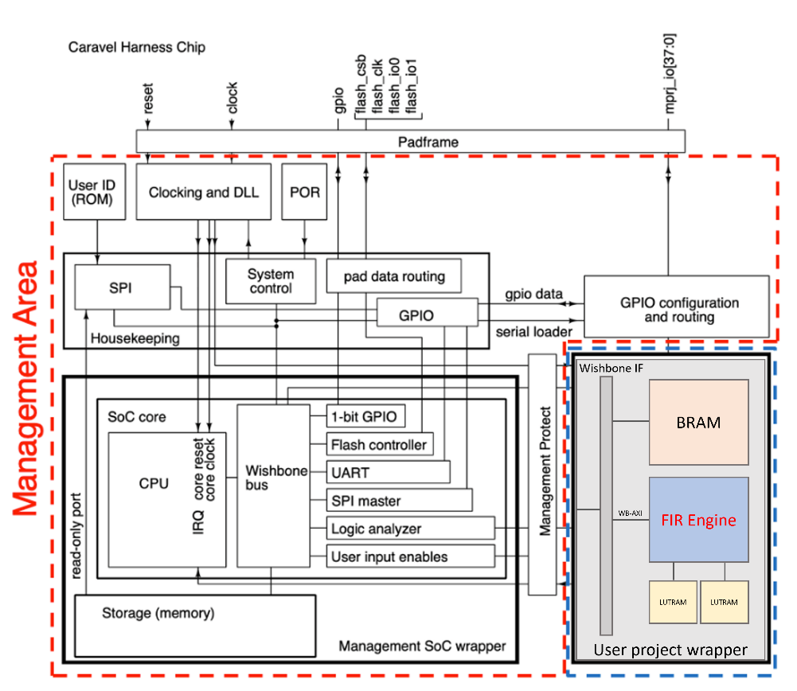
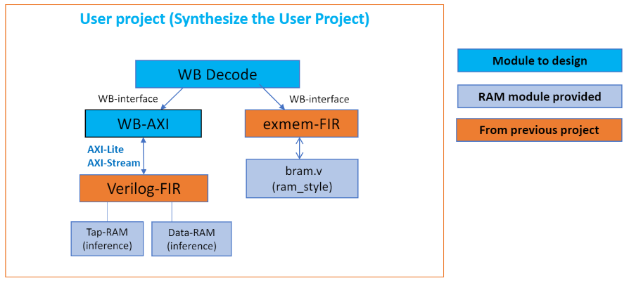
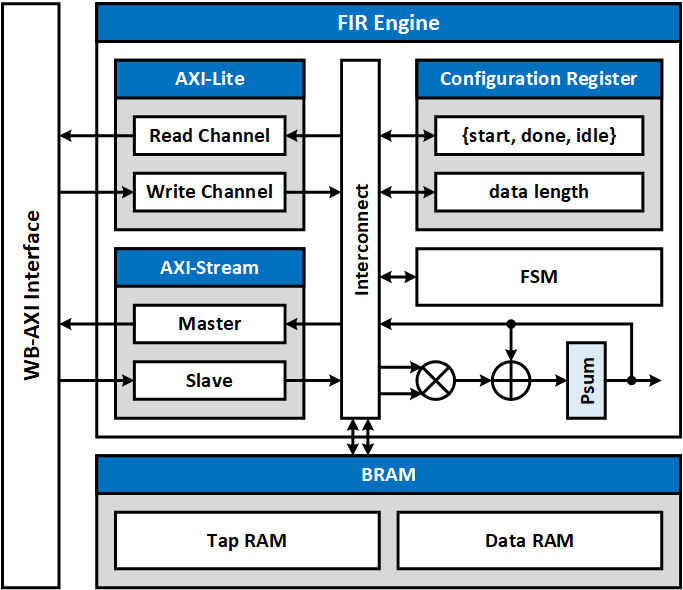

# Caravel FIR
Integrate FIR Engine and Execution Memory with WB-AXI Interface into User Project Area of Caravel SoC

## Simulation for Exmem-FIR
```sh
cd ./lab-exmem_fir/testbench/counter_la_fir
source run_clean
source run_sim
```

## Simulation for Caravel-FIR
```sh
cd ./lab-caravel_fir/testbench/counter_la_fir
source run_clean
source run_sim
```

## Block diagram
### Caravel SoC


### User project


### Verilog-FIR

